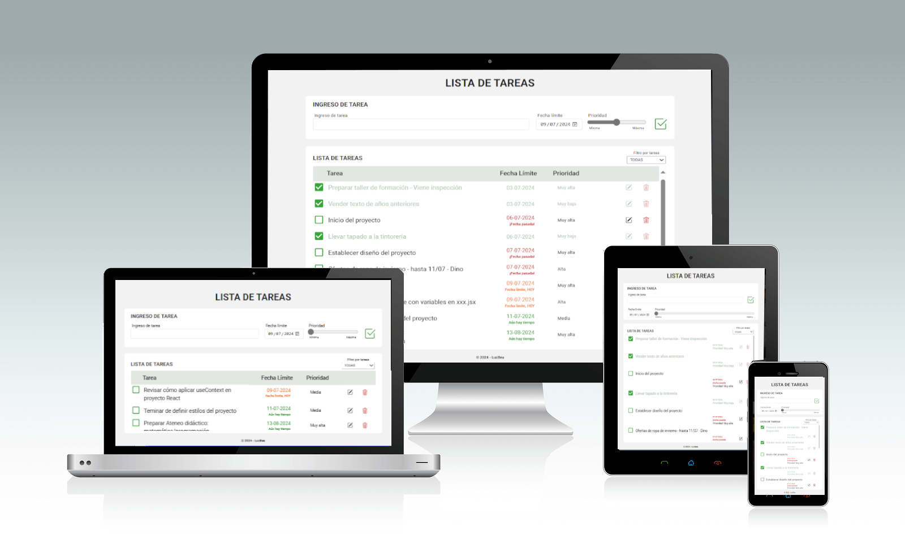

___
# ***Hola, soy Lucía Ferrer 👋!***
___

### Una apasionada de la programación Frontend   ♥
---

    En este trabajo se desarrollo la aplicación "Lista de Tareas", y los primeros 
    aprendizajes sobre la manera de aplicar REACT y MUI.

---
### Tecnologías que usé en mi proyecto

Este trabajo fue desarrollado utilizando las siguientes tecnologías:  

|   |    | ||
| :---: | :---: | :---: | :---: |
|Lenguaje de marcado de hipertexto. Consiste en marcas basado en etiquetas que otorgan la estructura básica de la app.| Lenguaje de programación. Otorga interactividad a las distintas secciones que conforman la app. |Una de las librerías más populares de JavaScript para el desarrollo de aplicaciones móviles y web.| Librería de componentes que ofrece un conjunto integral de herramientas de interfaz de usuario.|

 

### 

[¡Haz clic aquí para explorar el proyecto en tu navegador!](https://lucbea-tasklist.netlify.app)
---

##### Espero que lo disfrutes, como lo hice yo cuando lo programé!
---
### **Imágenes de mi proyecto**

| Inicio de la App "Lista de Tareas |
|    :---:  |
|Al comenzar a utilizar la App se solicita se registren las tareas, su prioridad y fecha límite de finalización. Estos datos se guardan en LocalStorage. El mismo diseño se aplica cuando, habiendo tareas, al ser filtradas, no hay tareas de ese tipo para mostrar.|
||
|Cuando hay tareas registradas en Local Storage y el filtro devuelde tareas de ese tipo, el usuario obtendrá una pasntalla similar a la siguiente.
||

 

<!-- 
  -->
<!-- 
 -->
| Ingreso de tareas |
|:---:|
|Posibilidad de ingresar tareas, , eligiendo fecha en que tiene que estar finalizada y prioridad de realización de la tarea. Control de ingreso de texto y fecha. Al ingresar una nueva tarea el "Filtro por tareas" se inicializa en "Todas" para permitir la visualización de la tarea recién ingresada.|

|Solicitud de texto entre 3 y 50 caracteres.|Solicitud de fecha a partir del día actual.|
|    :---:  |   :---:  |
|| |
||

 

|Listado de las tareas ingresadas. | 
|:---:|
|Listado de las tareas, ordenados por fecha y prioridad: las tareas se ordenan desde las fechas pasadas hacia las fechas futuras. Dentro del grupo de tareas que deben finalizarse en una fecha determinada, se produce un ordenamiento desde la prioridad "Muy alta" hacia la prioridad "Muy baja", de manera decreciente. Las fechas límites tienen un marcador de color que indica la cercanía hacia la fecha límite: se colorean de rojo las tareas que tienen fecha límite en el pasado, de naranja las tarea que tienen fecha límite coincidente con el día actual y de verde las tareas que tienen fecha límite en el futuro.|
||
||

 

| Filtro por tareas: todas, tareas completas y tareas incompletas.|
|    :---:  |
|Las tareas pueden filtrarse según si están "Completas" o "Incompletas". Además, las tareas tienen la opción de marcar las ya completadas con un check. Este proceso es dinámico. Por ejemplo, si las tareas están filtradas por "Incompletas" y se aplica el check, la tarea desaparece de la lista de tareas incompletas.|
||
||

 

| Edición de información de la tarea. |
|:---:|
|Las tareas pueden editarse. En la edición se controla que la cantidad de caracteres del texto esté entre 3 y 50 caracteres. Además se posibilita que se pueda modificar la fecha límite asociada a la tarea; si la fecha límite es pasada, se indica con el mensaje "Está ingresando una fecha pasada" pero el sistema acepta la incorporación de esa fecha para permitir que tareas que se hayan terminado con fechas anteriores al día presente puedan registrarse con la fecha de completamiento.|
||
||

 

| Eliminación de la tarea. |
|:---:|
|Las tareas pueden eliminarse. Para esto se solicita, mediante la muestra de la tarea que se procederá a borrar, que el usuario vuelva a confirmar la eliminación. Según la tarea esté completa o no se adapta el mensaje en contenido y colores utilizados.|
||

Mensaje de confirmación de eliminación para tarea realizada.|Mensaje de confirmación de eliminación para tarea sin realizar.|
|    :---:  |   :---:  |
|| |

 

|RESPONSIVE|
|:---:|
|La app "Lista de Tareas" puede utilizarse en distintos dispositivos debido a su performance "responsive". Además permite la adaptación, en el mismo dispositivo, según la orientación sea landscape o portrait. |
|| |

---
### **¡Contactame!**
¿Te gusta lo que ves? ¡Me encantaría saber tu opinión! No dudes en contactarme... 

--- 